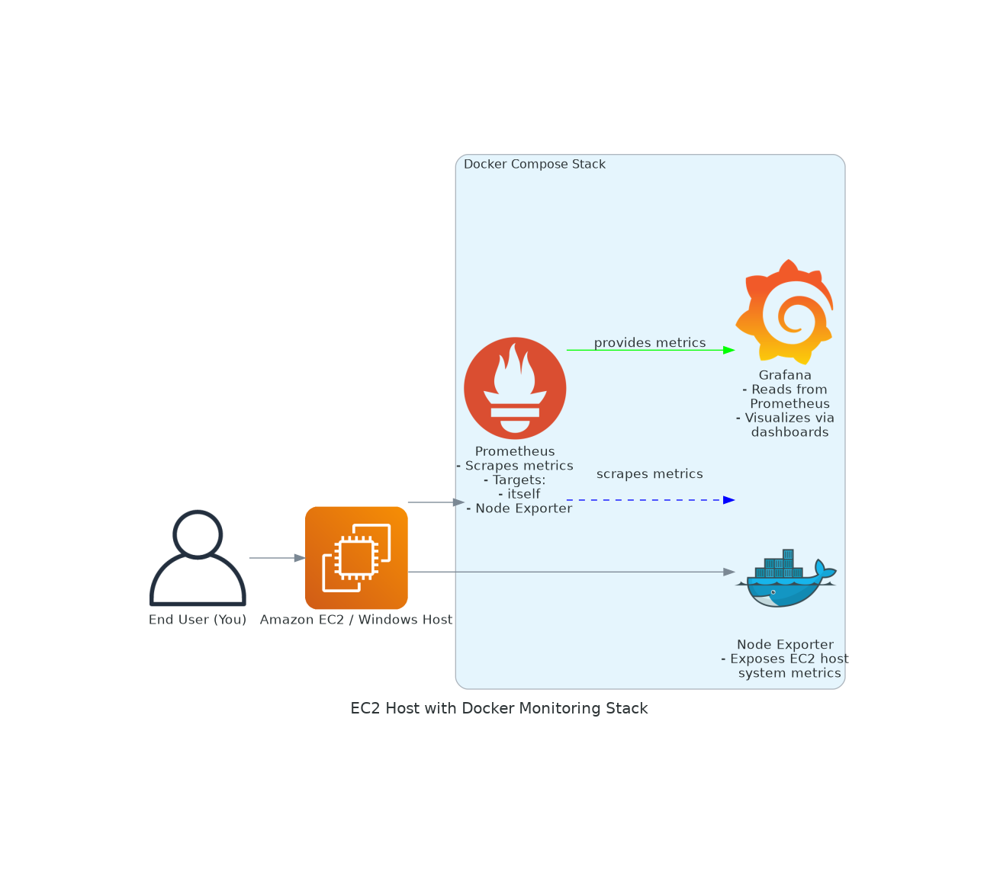
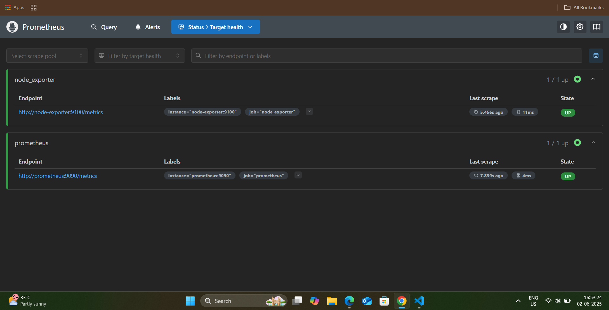
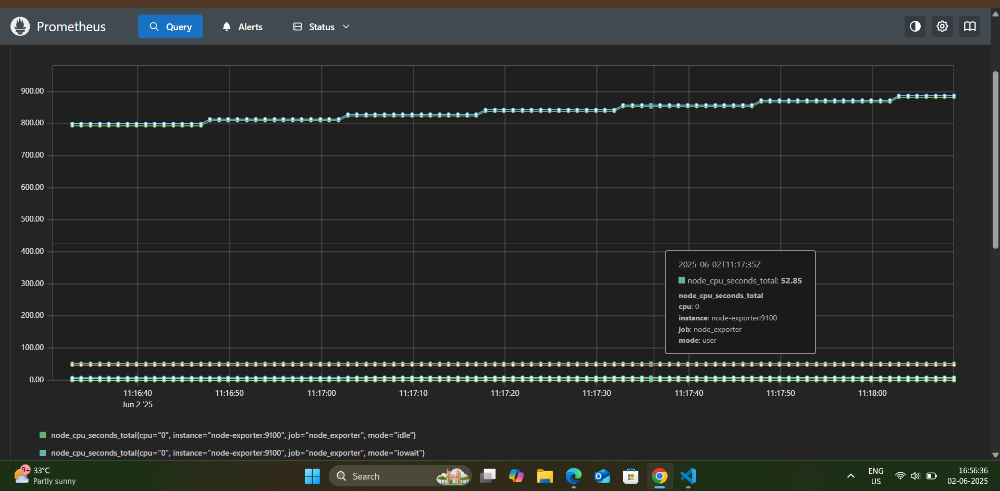
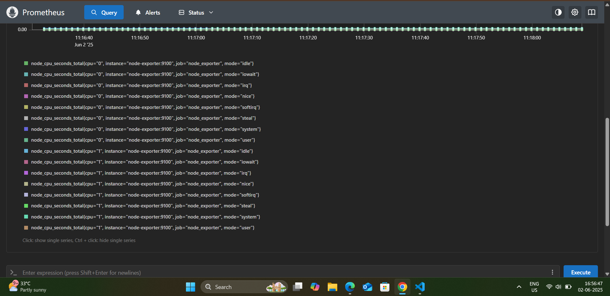
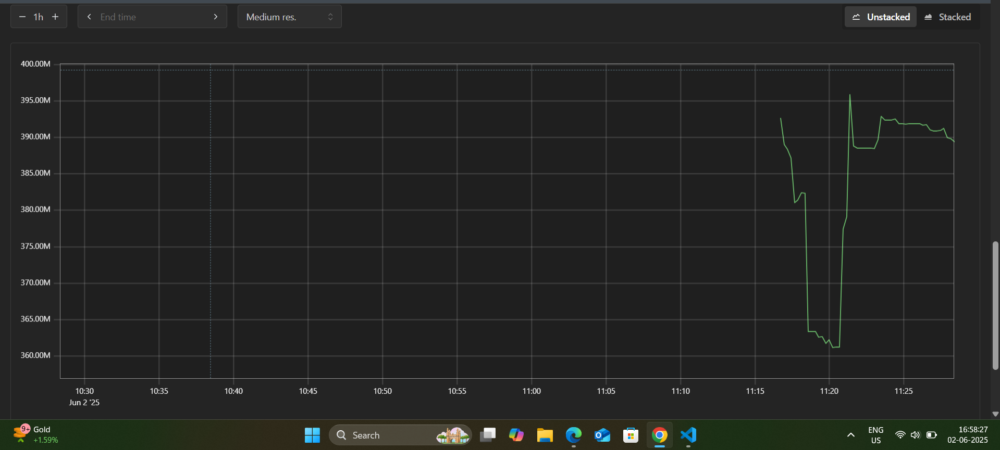
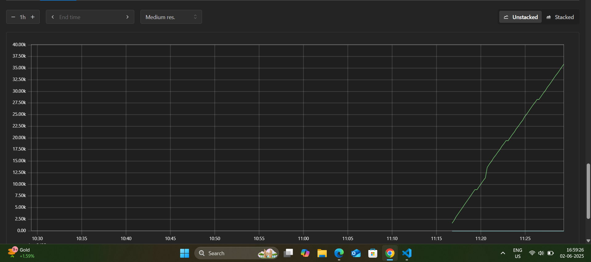
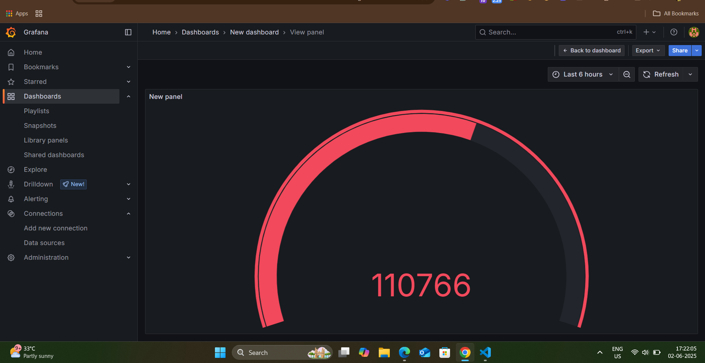
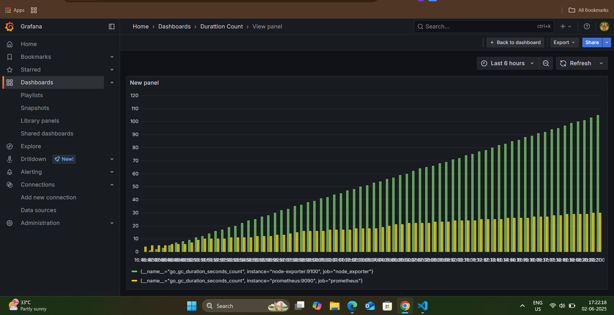
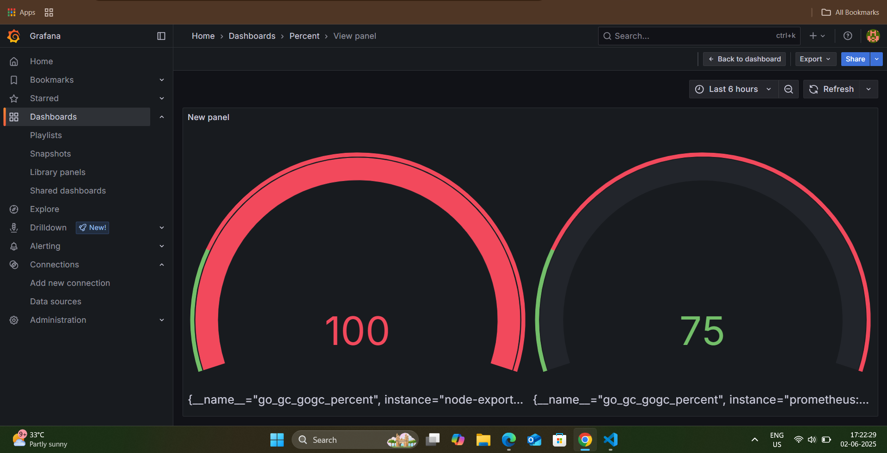
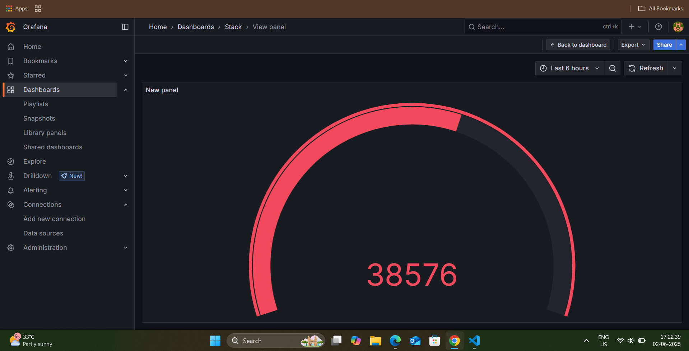

📊 Docker Monitoring Stack with Prometheus and Grafana
======================================================

🔧 Overview
-----------

A lightweight, production-grade observability stack using Docker Compose, Prometheus, Node Exporter, and Grafana, deployable on any Linux or Windows host (including AWS EC2).

💡 Architecture
-----------

💡 Features
-----------

*   Prometheus for time-series metric scraping
*   Node Exporter for host-level metrics
*   Grafana for interactive dashboard visualization
*   Runs via Docker Compose
*   Minimal setup, production layout

📁 Tech Stack
-------------

*   Docker & Docker Compose
*   Prometheus
*   Grafana
*   Node Exporter
*   Amazon Linux 2 / Windows 11

📂 Repository
-------------

[GitHub Repository](https://github.com/trivediayush/Docker-Monitoring-Stack)

📊 Dashboard Access
-------------------

*   Grafana: `http://localhost:3000` or `http://<EC2-IP>:3000`
*   Prometheus: `http://localhost:9090`
*   Node Exporter: `http://localhost:9100`

📉 Architecture
---------------

Amazon EC2 instance runs Docker containers for each component. Prometheus scrapes system metrics, which are then visualized through Grafana. Node Exporter exposes host performance data on port 9100.

📸 Screenshot's
------------------

✅ Node-Expoter
------------------

✅ Prometheus
------------------

✅ Grafana
------------------

🧠 Author
------------------
# Ayush Trivedi
